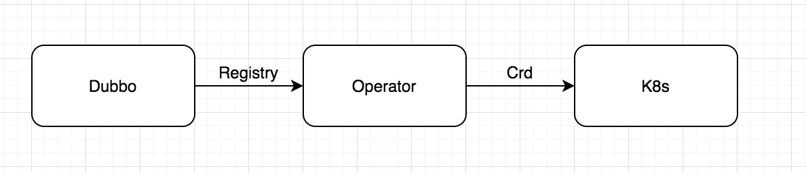
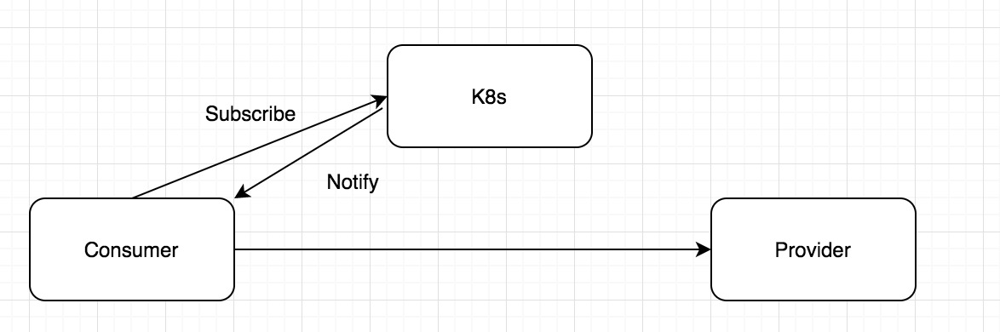
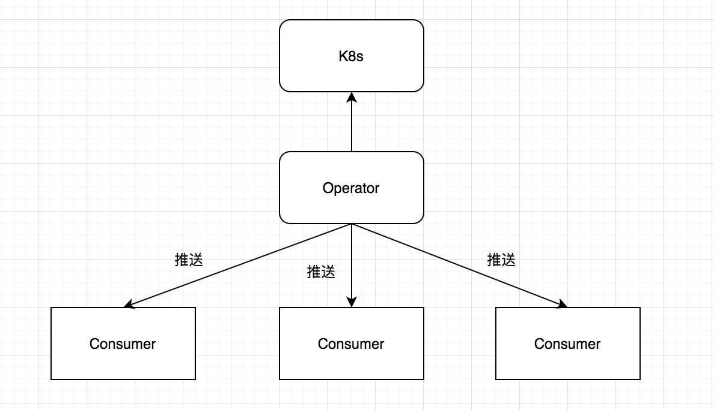

# DubboOperator的思路
## 现状
目前dubbo服务的注册和发现依赖的服务注册中心有zookeeper、etcd、consul、eureka、nacos等，dubbo Provider服务通过向这些注册中心注册interface数据，而dubbo Consumer通过从注册中心subscribe对应的接口信息，并且watch注册数据的变化。

k8s的服务注册发现是基于service纬度的，与dubbo的interface纬度不匹配，如spring cloud的服务，服务的域名通过k8s service直接暴露出来，client端可以直接通过域名完成服务调用，而dubbo的注册数据目前不支持。

## Dubbo Operator
Operator 是由 CoreOS 开发的，用来扩展 Kubernetes API，特定的应用程序控制器，它用来创建、配置和管理复杂的有状态应用，如数据库、缓存和监控系统。Operator 基于 Kubernetes 的资源和控制器概念之上构建，但同时又包含了应用程序特定的领域知识。创建Operator 的关键是CRD（自定义资源）的设计。目前Operator的使用越来越广泛，如Promethues Operator、Etcd Operator、Istio Operator等。



通过Operator可以对特定的资源进行特定的操作，Operator针对大多数的应用而言作用主要是服务的部署、健康检查、服务的Service暴露等，针对Dubbo服务，Operator可以做以下几点：

### 服务的部署

#### 定义一个DubboService Crd

``` yaml
apiVersion: apiextensions.k8s.io/v1beta1
kind: CustomResourceDefinition
metadata:
  name: dubboservices.app.example.com
spec:
  group: app.example.com
  names:
    kind: DubboService
    listKind: DubboServiceList
    plural: dubboservices
    singular: dubboservice
  scope: Namespaced
  subresources:
    status: {}
  validation:
    openAPIV3Schema:
      properties:
        apiVersion:
          description: 'APIVersion defines the versioned schema of this representation
            of an object. Servers should convert recognized schemas to the latest
            internal value, and may reject unrecognized values. More info: https://git.k8s.io/community/contributors/devel/api-conventions.md#resources'
          type: string
        kind:
          description: 'Kind is a string value representing the REST resource this
            object represents. Servers may infer this from the endpoint the client
            submits requests to. Cannot be updated. In CamelCase. More info: https://git.k8s.io/community/contributors/devel/api-conventions.md#types-kinds'
          type: string
        metadata:
          type: object
        spec:
          type: object
        status:
          type: object
  version: v1
  versions:
  - name: v1
    served: true
    storage: true
``` 

#### 服务Crd

dubbo operator将dubbo服务的接口列表通过metadata的annotations注册到k8s中，需要每个dubbo服务启动前生成对应crd文件，通过kubectl执行这个命令即可

``` yaml
apiVersion: app.example.com/v1
kind: DubboService
metadata:
  name: dubbo-app
  namespace: xxxxx
  annotations: 
    "inteface1": xxxxxx
    "inteface2": xxxxxx
spec:
  size: 2
  image: xxxxx
  ports:
    - port: 20880
      targetPort: 20880
      nodePort: 30002
``` 


### 服务更新

服务重新部署后及时更新对应的interface数据

## 服务消费

有以下几个方案考虑：

### Consumer对接k8s



Consumer服务直接通过k8s api Server订阅对应的服务，从annotations获取服务注册列表，找到后直接访问对应的服务（这里访问服务可以通过Service域名的方式，也可以通过endpoint ip访问），这样的方式简单直接，但是会有2个问题：

- 1、k8s api Server性能问题，如果服务过多，会导致k8s集群不稳定
- 2、通过watch服务的方式需要开发者定义服务、接口时候比较规范，通过服务名、namespace去k8s获取需要的数据


### Consuemr对接Opreator



Istio和Sidecar的形式上，sidecar自己不做服务发现，服务发现是通过istio pilot下发给sidecar，Opreator可以提供类似的功能，提供一个grpc的接口，通过不断的监听k8s上服务的变化，然后将结果推送给对应的服务，这里可以避免服务过多导致k8s api Server的性能问题，但是也引入了2个问题：

- 1、Opreator获取到变化后如何推送给Consumer，全量推送比较简单，把所有更新都推送给每个服务，也可以做增量推送，更新了什么推送什么（istio 1.5之前的版本都是全量推送， 被一直吐槽性能问题）
- 2、Opreator是一个无状态的应用，推送给Consumer的数据会是所有dubbo服务的，当然Consumer端可以去除自己不关心的接口数据

优点就是如果后续dubbo go对接istio的话，istio pilot实现dubbo服务发现的数据推送跟Opreator一致

dubbo sdk端开一个grpc接口与Opreator的服务推送接口进行双向通信，随时接受更新的数据


## Operator使用
Operator可以直接通过Operator Framework生成一个框架，生成后添加对应的逻辑即可

在pkg/controller/appservice/appservice_controller.go中Reconcile不断的 watch 资源的状态，然后根据状态的不同去实现各种操作逻辑，其中可以包含服务的创建、启动、健康检查，数据推送。

可以参考https://www.qikqiak.com/post/k8s-operator-101/

未完待续

